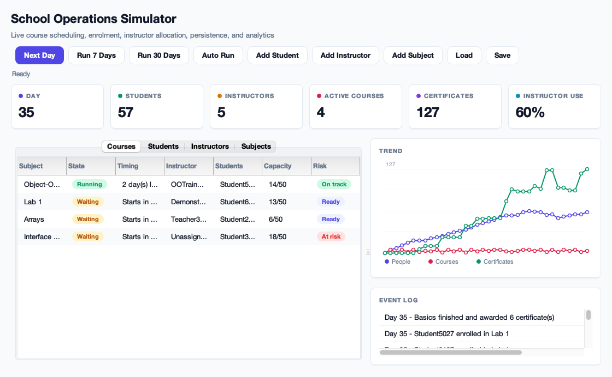
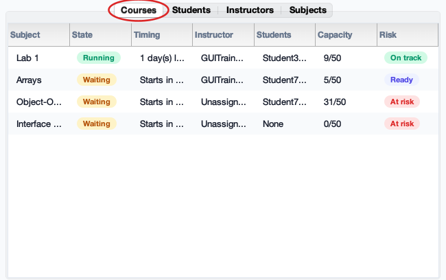
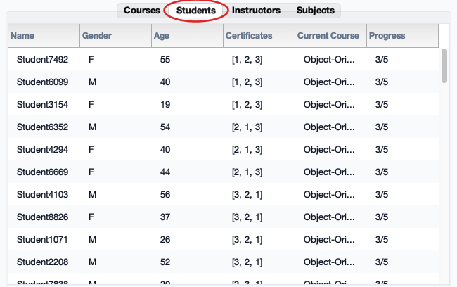
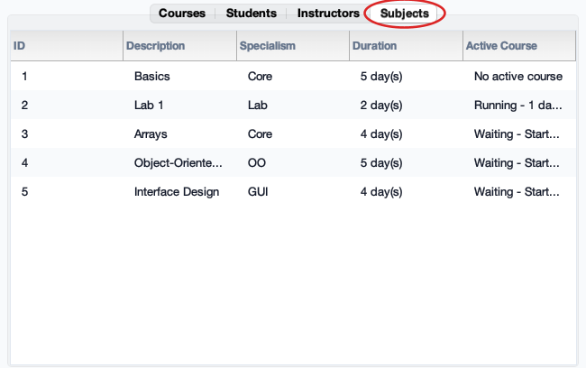
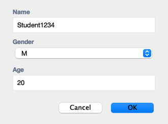
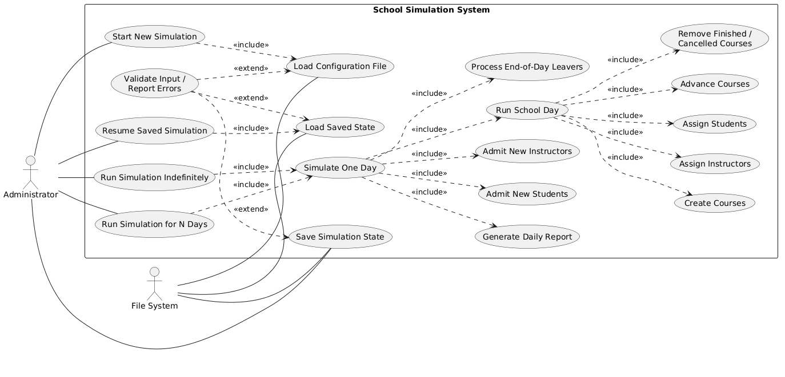
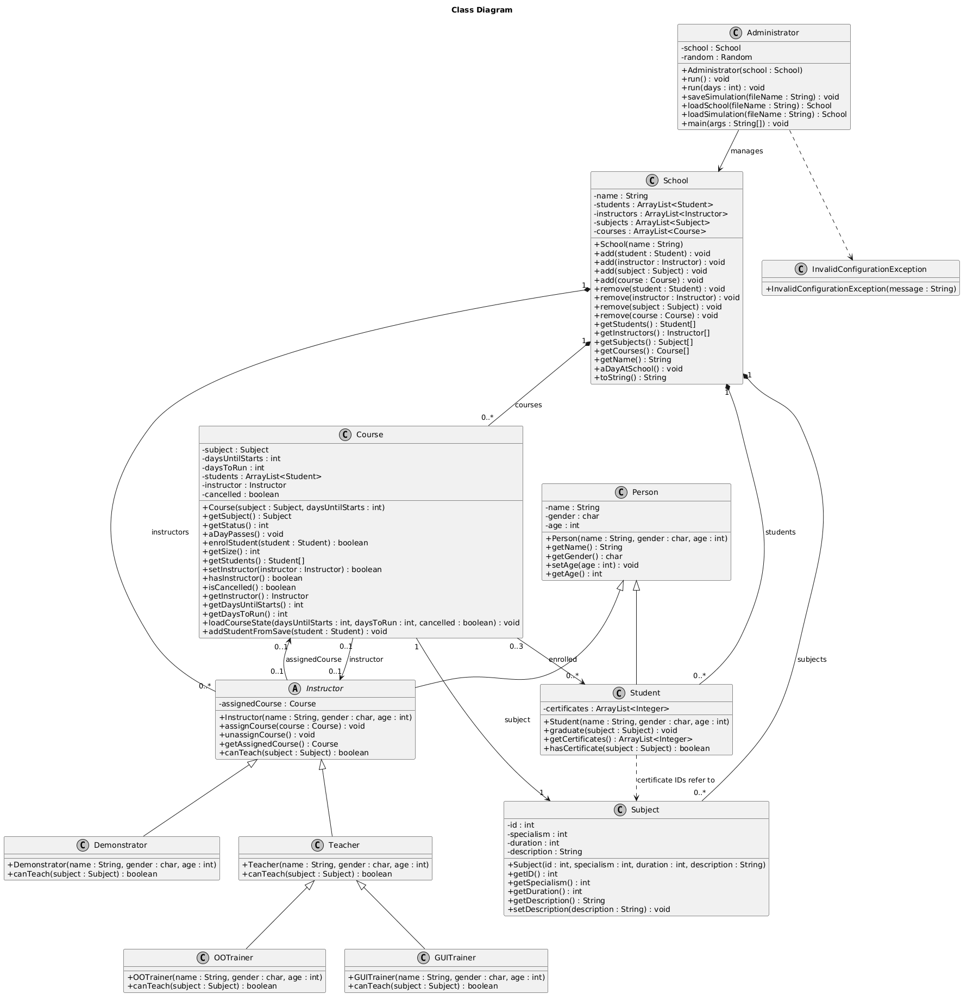
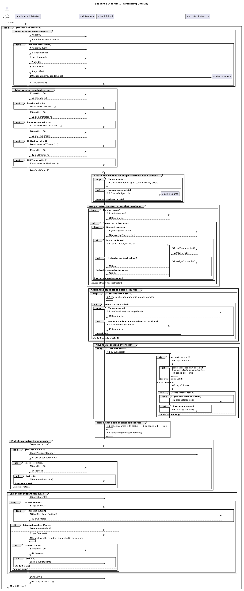
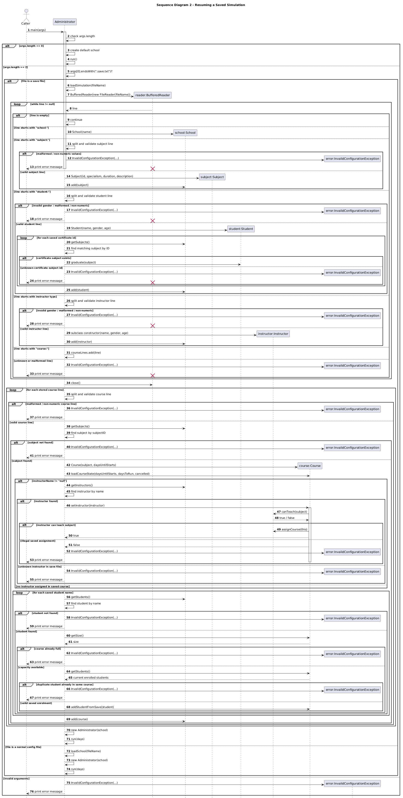

# School Operations Simulator

[](https://github.com/georgijv-sys/school-management-simulator/actions/workflows/ci.yml)
[](LICENSE)
[](https://www.oracle.com/java/)

A Java Swing desktop application for simulating the daily operations of a training school. The simulator models students, instructors, subjects, course scheduling, enrolment, course completion, certificates, persistence, and operational analytics through both a GUI dashboard and a console runner.

The project was built as an object-oriented Java application with a clear domain model, interactive dashboard, file-based save/load support, and automated JUnit tests.

<p align="center">
  
</p>
<p align="center"><em>The live dashboard: operational metrics, sortable course table with status badges, a multi-metric trend chart, and a running event log.</em></p>

## Key Skills Demonstrated

- Object-Oriented Programming
- Inheritance and Polymorphism
- Software Architecture and Design
- Java Collections Framework
- Exception Handling
- File I/O and Persistence
- Swing GUI Development
- Event-Driven Programming
- Simulation Modelling
- Data Visualisation
- Multithreaded GUI Operations
- JUnit Testing

## Features

- Simulates school operations over single-day or multi-day runs.
- Creates and manages subjects, students, instructors, and active courses.
- Assigns instructors according to teaching specialisms.
- Enrols students while respecting course capacity and certificate requirements.
- Tracks course starts, cancellations, completions, graduations, and departures.
- Displays live dashboard metrics, sortable tables, an event log, and a trend chart.
- Saves and loads full simulation state, including current day, active courses, assigned instructors, enrolled students, and certificates.
- Supports configuration-file loading with validation and clear error messages.
- Includes a console entry point for command-line simulation runs.

## Screenshots

### Data tabs

Each tab is a live view of the simulation; capacity, availability, and certificate progress update as days advance. The circled tab marks the active view.

<table>
  <tr>
    <td align="center" width="50%">
      <strong>Courses</strong><br>
      <br>
      <em>Active courses with state, timing, instructor, enrolment, and risk badges.</em>
    </td>
    <td align="center" width="50%">
      <strong>Students</strong><br>
      <br>
      <em>Certificates earned, current course, and progress toward every subject.</em>
    </td>
  </tr>
  <tr>
    <td align="center" width="50%">
      <strong>Instructors</strong><br>
      <br>
      <em>Type, teachable subjects, assigned course, and availability status.</em>
    </td>
    <td align="center" width="50%">
      <strong>Subjects</strong><br>
      <br>
      <em>The catalogue: specialism, duration, and any active course's status.</em>
    </td>
  </tr>
</table>

### Adding records

Toolbar actions open input dialogs. Subject IDs are validated so duplicates are rejected.

<table>
  <tr>
    <td align="center" width="50%">
      <strong>Add Student</strong><br>
      <br>
      <em>Name, gender, and age.</em>
    </td>
    <td align="center" width="50%">
      <strong>Add Instructor</strong><br>
      <br>
      <em>Choose the instructor type, then name, gender, and age.</em>
    </td>
  </tr>
  <tr>
    <td align="center" width="50%">
      <strong>Add Subject</strong><br>
      <br>
      <em>Description, ID, specialism, and duration.</em>
    </td>
    <td align="center" width="50%">
      <strong>Duplicate-ID validation</strong><br>
      <br>
      <em>Picking an existing subject ID is rejected with a prompt to choose another.</em>
    </td>
  </tr>
</table>

## Architecture & Project Structure

The simulation model is kept separate from the user interface: the domain classes hold the rules, while `SchoolDashboardApp` handles presentation. This keeps the business logic testable and prevents the GUI from owning the core behaviour.

```text
.
├── pom.xml                       Maven build (Java 11, JUnit)
├── LICENSE
├── README.md
├── .github/workflows/ci.yml      CI — runs the test suite on every push
├── docs/
│   ├── diagrams/                 UML: use case, class, and sequence diagrams
│   └── screenshots/              Dashboard images used in this README
├── test/                         JUnit test suite
└── src/
    ├── Administrator.java        Simulation runner, persistence, CLI entry point
    ├── School.java               School state and daily scheduling rules
    ├── Course.java               Course lifecycle: enrolment, cancellation, completion
    ├── Person.java               Base class for people
    ├── Student.java              Student and certificate state
    ├── Instructor.java           Abstract instructor type
    ├── Teacher.java              Teaches Core and Lab subjects
    ├── Demonstrator.java         Teaches Lab subjects only
    ├── OOTrainer.java            Teacher that also teaches Object-Oriented subjects
    ├── GUITrainer.java           Teacher that also teaches GUI subjects
    ├── Subject.java              Subject metadata (id, specialism, duration)
    ├── SimulationEvent.java      Event model shared by the simulator and dashboard
    ├── Theme.java                Centralised UI theme: colours, fonts, components
    └── SchoolDashboardApp.java   Swing dashboard: tables, chart, controls, background tasks
```

## Design & UML Diagrams

The system was modelled with UML before implementation. These diagrams capture its actors, structure, and runtime behaviour.

### Use Case Diagram

The Administrator drives the simulation (start, resume, run for N days, run indefinitely) while the File System participates in configuration loading and save/load. `Run School Day` and `Simulate One Day` decompose into the daily scheduling steps via `«include»`, with input validation modelled as `«extend»`.

<p align="center">
  
</p>

### Class Diagram

The domain model: the `Person` hierarchy (`Student`, and the abstract `Instructor` specialised by `Teacher` → `OOTrainer`/`GUITrainer`, plus `Demonstrator`), `School` aggregating people, subjects, and courses, `Administrator` orchestrating the simulation and persistence, and the multiplicities between `Course`, `Subject`, `Instructor`, and `Student`.

<p align="center">
  
</p>

### Sequence Diagrams

**Simulating one day** — admitting people, creating courses, assigning instructors, enrolling students, advancing courses, and end-of-day removals:

<p align="center">
  
</p>

**Resuming a saved simulation** — parsing and validating a save file, then reconstructing courses, instructors, and enrolments:

<p align="center">
  
</p>

## Getting Started

### Prerequisites

- Java 11 or newer
- Maven, for running the JUnit test suite

### Run the Dashboard

Compile the project:

```bash
javac -d out src/*.java
```

Start the Swing dashboard:

```bash
java -cp out SchoolDashboardApp
```

### Run from the Console

Run the default simulation continuously:

```bash
java -cp out Administrator
```

Run a fixed number of days from a configuration file:

```bash
java -cp out Administrator school.txt 30
```

Run a fixed number of days from a saved simulation:

```bash
java -cp out Administrator school.save.txt 30
```

## Testing

The project includes JUnit tests for the main simulation rules and persistence workflow.

Run the test suite:

```bash
mvn test
```

Current test coverage includes:

- Instructor specialism rules
- Course capacity, start, cancellation, completion, and certificate awarding
- Daily school scheduling and student enrolment
- Configuration file parsing and validation
- Save/load restoration of active simulation state

## Configuration File Format

Example `school.txt`:

```text
school:Java Training School
subject:Basics,1,1,5
subject:Lab 1,2,2,2
student:Alice,F,20
Teacher:Dr Smith,F,35
Demonstrator:Alex,M,28
OOTrainer:Casey,F,31
GUITrainer:Morgan,M,33
```

Subject format:

```text
subject:<description>,<id>,<specialism>,<duration>
```

Specialisms:

```text
1 = Core
2 = Lab
3 = Object-oriented programming
4 = GUI programming
```

## Implementation Notes

- The simulator uses Java collections to manage students, instructors, subjects, and courses.
- Instructors use polymorphism to define which subject specialisms they can teach.
- Save/load functionality uses plain text files so simulation state can be inspected and restored.
- The Swing dashboard uses event-driven controls and table models to keep the interface updated.
- Longer dashboard actions, such as running several days or loading/saving files, run in background `SwingWorker` tasks so the UI remains responsive.

## License

Released under the [MIT License](LICENSE).
