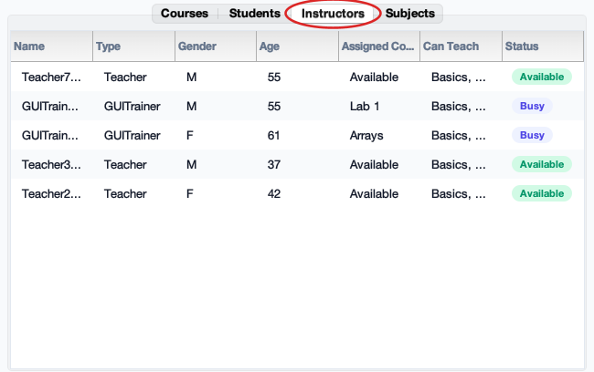
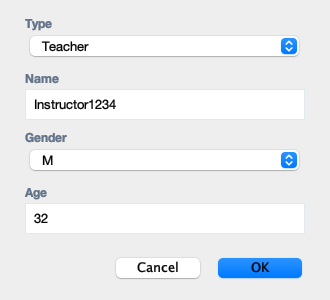
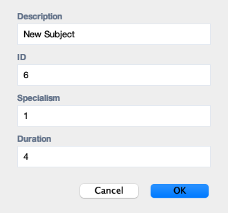
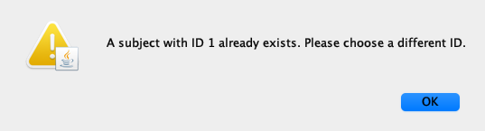

# School Operations Simulator

[](https://github.com/georgijv-sys/school-management-simulator/actions/workflows/ci.yml)
[](LICENSE)
[](https://www.oracle.com/java/)

A Java Swing desktop application for simulating the daily operations of a training school. The simulator models students, instructors, subjects, course scheduling, enrolment, course completion, certificates, persistence, and operational analytics through both a GUI dashboard and a console runner.

The project was built as an object-oriented Java application with a clear domain model, interactive dashboard, file-based save/load support, and automated JUnit tests.

<p align="center">
  
</p>
<p align="center"><em>The live dashboard: operational metrics, sortable course table with status badges, a multi-metric trend chart, and a running event log.</em></p>

## Key Skills Demonstrated

- Object-Oriented Programming
- Inheritance and Polymorphism
- Software Architecture and Design
- Java Collections Framework
- Exception Handling
- File I/O and Persistence
- Swing GUI Development
- Event-Driven Programming
- Simulation Modelling
- Data Visualisation
- Multithreaded GUI Operations
- JUnit Testing

## Features

- Simulates school operations over single-day or multi-day runs.
- Creates and manages subjects, students, instructors, and active courses.
- Assigns instructors according to teaching specialisms.
- Enrols students while respecting course capacity and certificate requirements.
- Tracks course starts, cancellations, completions, graduations, and departures.
- Displays live dashboard metrics, sortable tables, an event log, and a trend chart.
- Saves and loads full simulation state, including current day, active courses, assigned instructors, enrolled students, and certificates.
- Supports configuration-file loading with validation and clear error messages.
- Includes a console entry point for command-line simulation runs.

## Screenshots

### Data tabs

Each tab is a live view of the simulation; capacity, availability, and certificate progress update as days advance. The circled tab marks the active view.

<table>
  <tr>
    <td align="center" width="50%">
      <strong>Courses</strong><br>
      <br>
      <em>Active courses with state, timing, instructor, enrolment, and risk badges.</em>
    </td>
    <td align="center" width="50%">
      <strong>Students</strong><br>
      <br>
      <em>Certificates earned, current course, and progress toward every subject.</em>
    </td>
  </tr>
  <tr>
    <td align="center" width="50%">
      <strong>Instructors</strong><br>
      <br>
      <em>Type, teachable subjects, assigned course, and availability status.</em>
    </td>
    <td align="center" width="50%">
      <strong>Subjects</strong><br>
      <br>
      <em>The catalogue: specialism, duration, and any active course's status.</em>
    </td>
  </tr>
</table>

### Adding records

Toolbar actions open input dialogs. Subject IDs are validated so duplicates are rejected.

<table>
  <tr>
    <td align="center" width="50%">
      <strong>Add Student</strong><br>
      <br>
      <em>Name, gender, and age.</em>
    </td>
    <td align="center" width="50%">
      <strong>Add Instructor</strong><br>
      <br>
      <em>Choose the instructor type, then name, gender, and age.</em>
    </td>
  </tr>
  <tr>
    <td align="center" width="50%">
      <strong>Add Subject</strong><br>
      <br>
      <em>Description, ID, specialism, and duration.</em>
    </td>
    <td align="center" width="50%">
      <strong>Duplicate-ID validation</strong><br>
      <br>
      <em>Picking an existing subject ID is rejected with a prompt to choose another.</em>
    </td>
  </tr>
</table>

## Architecture Overview

The application separates the simulation model from the user interface:

```text
src/
  Administrator.java        Simulation runner, persistence, configuration loading, CLI entry point
  School.java               Core school state and daily scheduling rules
  Course.java               Course lifecycle, enrolment, cancellation, completion
  Person.java               Shared base class for people in the simulation
  Student.java              Student certificate state
  Instructor.java           Abstract instructor type
  Teacher.java              Core/lab instructor implementation
  Demonstrator.java         Lab-only instructor implementation
  OOTrainer.java            Object-oriented programming trainer
  GUITrainer.java           GUI programming trainer
  Subject.java              Subject metadata
  SimulationEvent.java      Event model used by the simulator and dashboard
  SchoolDashboardApp.java   Swing dashboard, tables, charts, controls, background tasks
```

The domain classes contain the simulation rules, while `SchoolDashboardApp` is responsible for presentation and user interaction. This keeps the business logic testable and prevents the GUI from owning the core behaviour.

## Getting Started

### Prerequisites

- Java 11 or newer
- Maven, for running the JUnit test suite

### Run the Dashboard

Compile the project:

```bash
javac -d out src/*.java
```

Start the Swing dashboard:

```bash
java -cp out SchoolDashboardApp
```

### Run from the Console

Run the default simulation continuously:

```bash
java -cp out Administrator
```

Run a fixed number of days from a configuration file:

```bash
java -cp out Administrator school.txt 30
```

Run a fixed number of days from a saved simulation:

```bash
java -cp out Administrator school.save.txt 30
```

## Testing

The project includes JUnit tests for the main simulation rules and persistence workflow.

Run the test suite:

```bash
mvn test
```

Current test coverage includes:

- Instructor specialism rules
- Course capacity, start, cancellation, completion, and certificate awarding
- Daily school scheduling and student enrolment
- Configuration file parsing and validation
- Save/load restoration of active simulation state

## Configuration File Format

Example `school.txt`:

```text
school:Java Training School
subject:Basics,1,1,5
subject:Lab 1,2,2,2
student:Alice,F,20
Teacher:Dr Smith,F,35
Demonstrator:Alex,M,28
OOTrainer:Casey,F,31
GUITrainer:Morgan,M,33
```

Subject format:

```text
subject:<description>,<id>,<specialism>,<duration>
```

Specialisms:

```text
1 = Core
2 = Lab
3 = Object-oriented programming
4 = GUI programming
```

## Implementation Notes

- The simulator uses Java collections to manage students, instructors, subjects, and courses.
- Instructors use polymorphism to define which subject specialisms they can teach.
- Save/load functionality uses plain text files so simulation state can be inspected and restored.
- The Swing dashboard uses event-driven controls and table models to keep the interface updated.
- Longer dashboard actions, such as running several days or loading/saving files, run in background `SwingWorker` tasks so the UI remains responsive.

## Project Structure

```text
.
├── pom.xml
├── README.md
├── LICENSE
├── .github/
│   └── workflows/
│       └── ci.yml          GitHub Actions: runs the test suite on every push
├── docs/
│   └── screenshots/        Images used in this README
├── src/
│   └── Java source files
└── test/
    └── JUnit test files
```

## License

Released under the [MIT License](LICENSE).
